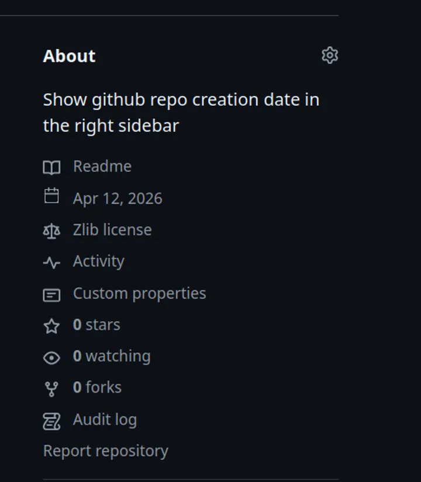

Show github repo creation date at right sidebar, seamlessly blend with other metadata.

The data is obtained from Github API, which mean the data is purely on the repo creation metadata, not tied to first commit.

Special thanks to [ungh](https://ungh.cc) for providing a ratelimit-free proxy to Github API.

## Screenshot

## License

Licensed under [Zlib License](LICENSE)